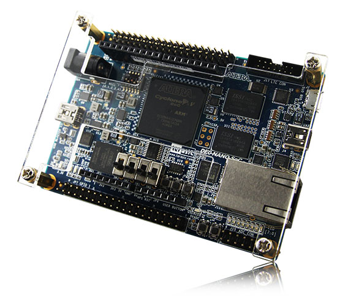

# DE0-Nano-SoC / Atlas-SoC

This project contains a simple FPGA build framework for the
[DE0-Nano-SoC / Atlas-SoC](http://www.terasic.com.tw/cgi-bin/page/archive.pl?Language=English&CategoryNo=163&No=941&PartNo=1)
development platform.



More info about the kit can be found in
https://rocketboards.org/foswiki/view/Documentation/AtlasSoCDevelopmentPlatform

Maintained by Svein Seldal <sveinse@seldal.com>. Last updated 2017-11-19.


## Introduction

This repo is based on the GHRD design found in Terasic System CD v1.1.0. The
build system, the Makefile, is based on Altera's reference design found in the
SoCEDS installation files. This Makefile has some shortcomings and this project
has made some improvements to it.

The goal of the project is to make a simple workflow for compiling software for
the DE0-Nano-SoC / Atlas-SoC kit. The framework also acknowledge that the FPGA
development often happen independently of the software Linux development,
so this framework allows for handovers from step to step.

The assumptions in this setup are:

 * Intel Quartus Prime and SoC EDS installed on system
 * Build for DE0-Nano-SoC / Atlas-SoC
 * Run Linux on the SoC
 * Boot from a SDCard


## Setup

The project is based on a single `Makefile`. Typing `make` or `make help` in
the command-line will print a simple overview of the major commands.

Much of the Makefile relies on having the Intel Quartus Prime tools available.
Please use the SoC EDS command shell and call `make` from here.

To clean an project `make scrub` can be used. Note that the cleaning is
quite aggressive, so be careful to have backups of the directory before
cleaning.


## Overview

Multiple steps are required to build the image for a complete FPGA based
SoC. 

 1. Build the FPGA system
 2. Build the boot system
 3. Build the target file system, including kernel
 4. Create a SDcard


## Step 1 - Build the FPGA system

This step is compiling the FPGA image. It uses the Intel Quartus Prime
toolsuite. It supports both an interactive GUI based development and compiled
from scripts.

The output from this step is the handoff file found in
`output_files/fpga_files.tar.gz`.


### Project setup

To make the Quartus project compatible with the build structure required
by the Makefile, please set the following project setting using either of
these two methods:

  1) In Quartus GUI using Settings > Compilcation Process Settings > Save
     project output files in specified directory and enter 'output_files'

  2) Set in Quartus settings file *.qsf 

```
     set_global_assignment -name PROJECT_OUTPUT_DIRECTORY output_files
```


### 1a) Interactive FPGA Compilation in Quartus Prime

  1. Open project (*.qpf) in Quartus Prime
  2. Open QSys and open *.qsys file and generate HDL. Finish
  3. Run Analysis & Sythesis (Ctrl+K)
  4. Run tcl scripts for SDRAM assignments
```
     soc_system/submodules/hps_sdram_p0_paramters.tcl
     soc_system/submodules/hps_sdram_p0_pin_assignments.tcl
```
  5. Compile project (Ctrl+L)
  6. Use programmer to program device

To build the handoff file, `output_files/fpga_files.tar.gz`

  1. Open SoC EDS Command Shell
  2. `make quartus_ok`
  3. `make fpga`

The `make quartus_ok` command will mark the build steps involving the Quartus
compiler as complete. This is a nice way if the development is made in the GUI
and one need to tell the build system that all the expected files have been
generated and not force a restart.


### 1b) Scripted FPGA Compilation

To compile the FPGA and create the handoff file, `output_files/fpga_files.tar.gz`

  1. Open SoC EDS Command Shell
  2. `make fpga`

Other manual operation exists:

  * `make quartus_compile`
  * `make quartus_edit`
  * `make qsys_compile`
  * `make qsys_edit`
  * `make program_fpga`


## Step 2 - Build the boot system

The boot system provides all necessary files which the FPGA requires for
starting up the device. The boot system consist of the preloader, bootloader,
boot configuration and the FPGA image in a format that can be used by the
bootloder.


### 2a) Prepare using FPGA handoff file

This step is needed if starting from an empty or cleaned project. The FPGA
handoff file must be copied into the project and unpacked to set the project
up for building the boot files.

This step is not necessary to do if the build already contains a completed
compilation from step 1.

To unpack a FPGA handoff file:

  1. `make FPGA_TGA=file fpga-unpack`

If the `FPGA_FILE=file` option is omitted, make will search for it in
`output_files/fpga_files.tar.gz`


### 2b) Build the boot files

To compile the boot handoff file, `output_files/sd_fat.tar.gz`

  1. `make sd-fat`


## Step 3 - Build the target Linux file system

FIXME. 
This project does not have any tools for building the target Linux file system.


## Step 4 - Create a bootable SDcard

FIXME
